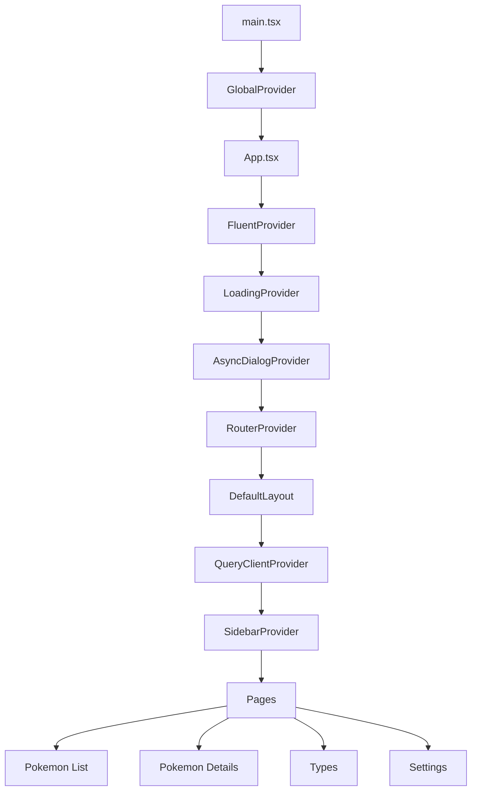

# Frontend Overview

This frontend is a Vite + React + TypeScript single-page application for browsing Pokémon data from the ASP.NET Core backend.

## Why this frontend exists

- Provide a responsive Pokédex UI on top of the backend API
- Explore modern React patterns with TypeScript
- Combine Fluent UI components with Tailwind CSS utilities

## Architecture

The application is structured around route pages, reusable UI components, helper utilities, and small focused providers.



### Directory structure

```text
Frontend/
├─ public/                  # Static assets
├─ src/
│  ├─ assets/               # Images and global styles
│  ├─ components/           # Shared UI building blocks
│  ├─ helpers/              # API, storage, string, theme, Pokémon helpers
│  ├─ layout/               # Shared app shell and sidebar
│  ├─ locales/              # i18n setup and translation resources
│  ├─ pages/                # Route-level screens
│  ├─ plugins/              # React Query client setup
│  ├─ providers/            # Context providers
│  ├─ stores/               # Custom hooks and context consumers
│  ├─ types/                # Shared TypeScript types
│  ├─ App.tsx               # App composition root
│  ├─ main.tsx              # Entry point
│  └─ routes.tsx            # Router definition
├─ package.json
└─ vite.config.ts
```

## Current features

### Implemented

- Pokémon listing page with client-side filtering
- Virtualized grid rendering for large Pokémon lists
- Pokémon details page with:
  - basic info
  - stats
  - evolution chain and variants
  - type effectiveness
  - in-game encounter data
  - previous/next navigation
- Global loading overlay with optional progress state
- Async dialog/message system for alerts and confirmations
- Theme switching: light, dark, system
- Language switching: English, Japanese, Vietnamese
- Responsive sidebar layout

### Partial / in progress

- Type list and type detail pages are routed but still placeholder screens
- Localization infrastructure exists, but much of the Pokémon UI text is still hardcoded in English

## Technology stack

### Core

- React 19
- TypeScript
- Vite
- React Router

### UI and styling

- Fluent UI React Components
- Fluent UI Icons
- Tailwind CSS v4

### Data and state

- TanStack React Query for server-state caching
- React Context + custom hooks for app-level state

### Internationalization

- i18next
- react-i18next
- i18next-browser-languagedetector

### Tooling

- ESLint
- typescript-eslint

## Application flow

1. `src/main.tsx` loads global CSS and i18n, then mounts `GlobalProvider`.
2. `src/App.tsx` applies Fluent UI theme selection and wraps the app with loading and dialog providers.
3. `src/routes.tsx` defines the route tree.
4. `src/layout/index.tsx` provides the shared shell, sidebar, and React Query client.
5. Route pages fetch backend data through `src/helpers/apiHelper.ts`.

## Frontend to backend integration

The frontend talks to the ASP.NET Core backend through a small fetch wrapper in `src/helpers/apiHelper.ts`.

### API behavior

- Reads `VITE_API_URL` from environment variables
- Normalizes the base URL so requests target `/api/...`
- Sends requests with `credentials: include`
- Optionally includes `X-Dev-Access-Key` when configured for local development against a protected backend

### Endpoints currently consumed

- `GET /api/pokemon`
- `GET /api/pokemon/{id}`
- `GET /api/pokemon/{id}/next_prev`
- `GET /api/pokemon/{id}/evolution_chain`
- `GET /api/pokemon/{id}/type_efficacies`
- `GET /api/encounters/{id}`

### Assets

Pokémon images are resolved separately from `VITE_ASSETS_URL`, which points to external asset storage rather than the API server.

## State management approach

The app deliberately avoids a large external client-state library.

- `GlobalProvider`: theme and language preferences
- `LoadingProvider`: global loading and progress overlay
- `AsyncDialogProvider`: queued async dialog service
- `SidebarProvider`: sidebar expansion and mobile state

This keeps global concerns isolated while leaving page data to React Query.

## Notable design decisions

- **Read-mostly caching model:** React Query uses a very long stale time because the app mainly reads Pokédex data
- **Hybrid styling:** Fluent UI handles accessible components and design tokens, while Tailwind handles layout and utility classes
- **Responsive performance:** the Pokémon grid uses virtualization to reduce DOM cost on large datasets
- **Persistence for UX:** theme and language are stored in local storage, and the last viewed Pokémon is stored in session storage
- **Dialog layering:** dialogs mount into the Fluent provider root to avoid overlay and z-index issues

## Environment variables

Create a local `.env.development` with values appropriate for your environment.

Required variables:

- `VITE_API_URL` — backend base URL
- `VITE_ASSETS_URL` — asset base URL for Pokémon images

Optional variable:

- `VITE_DEV_ACCESS_KEY` — local development access key for protected backend scenarios

Do not commit real secrets to source control.

## Available scripts

- `pnpm dev` — start the Vite dev server
- `pnpm build` — type-check and build for production
- `pnpm lint` — run ESLint
- `pnpm preview` — preview the production build locally
